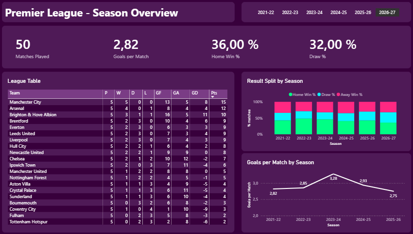
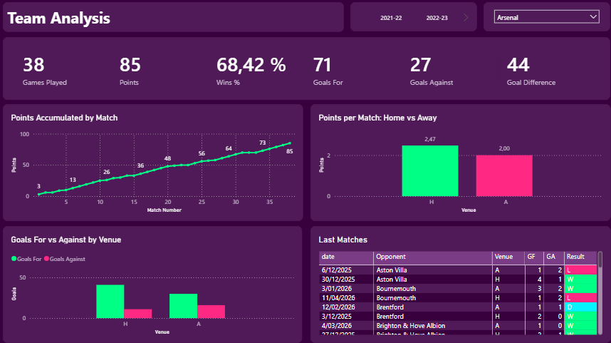
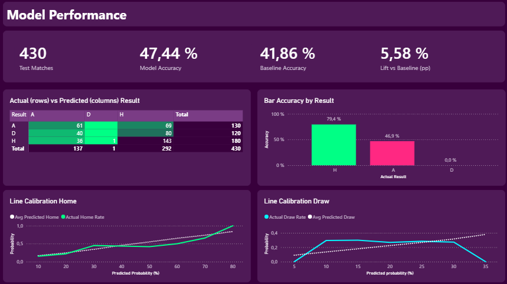
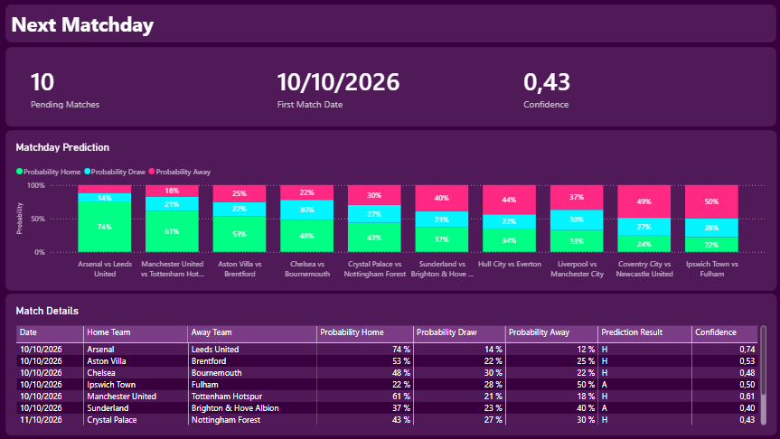

# Football Match Predictor

Predicting Premier League match outcomes (home win / draw / away win) with a leakage-safe Python pipeline and a four-page Power BI dashboard.

> **Honest summary:** the model beats the "always pick the home team" baseline by about 5.6 percentage points of accuracy on a temporal test set of 430 matches. That is a real but modest edge, and it is close to what is realistically achievable with public match data. It is **not** a betting system. See [Results](#results) and [Limitations](#limitations).


## Problem Statement

Football is a low-scoring, high-variance sport, so match outcomes are hard to predict. Many public "predictors" report inflated accuracy because of data leakage (using information from after the match) or random train/test splits that mix past and future.

This project asks a narrower, more honest question:

> Using only information available **before kickoff**, how much better than a naive baseline can we predict the result of a Premier League match, and how well calibrated are the probabilities?

## Description

An end-to-end analytics project:

1. **Python**: ingest data, clean it, engineer pre-match features, train and evaluate classifiers with a temporal split, export tables for BI.
2. **Power BI**: relational model, DAX measures and a four-page dashboard, including predicted probabilities for the next matchday.

Data coverage: Premier League, seasons 2021-22 to 2025-26 (historical CSVs) plus the 2026-27 season (played and scheduled fixtures from an API). The cleaned dataset (`matches_clean.csv`) has 2,280 rows, one per match [VERIFY: confirm that scheduled fixtures are included in the 2,280].

## Features

- Reproducible ingestion with raw data saved to disk (no repeated API calls).
- One-row-per-match clean dataset with a [data dictionary](docs/data_dictionary.md).
- Pre-match features: recent form, goals for/against, home/away split form, rest days, own Elo rating, head-to-head.
- Three models compared on the same temporal split: "always home" baseline, logistic regression, XGBoost.
- Evaluation with log loss, accuracy and probability calibration.
- Power BI dashboard with four pages (below) and DAX measures verified against Python.

## Technologies

| Area | Tool |
|---|---|
| Language | Python 3.13.5 |
| Data handling | pandas, NumPy |
| HTTP / API | requests, python-dotenv |
| Modeling | scikit-learn (logistic regression, metrics, calibration), XGBoost |
| BI | Power BI Desktop (Power Query, data model, DAX) |
| Version control / hosting | Git, GitHub |

Everything is free to use: no paid licenses or paid API tiers.

## Key Technical Decisions

- **Temporal validation, not random.** Train on the past, validate and test on later matches. A random split would let the model "see" the future and inflate metrics.
- **Leakage prevention by construction.** Each feature of a match is computed only from matches played before it (including Elo, which is updated after each match is used, never before). [VERIFY: describe the exact mechanism in `features.py`, e.g. shifting / expanding windows.] See `src/check_leakage.py` and the note in [Limitations](#limitations).
- **Log loss as the primary metric.** For probabilistic predictions, log loss rewards calibrated probabilities, whereas accuracy only checks the top pick.
- **Baselines first.** "Always home" and logistic regression set the bar; XGBoost has to earn its place.
- **XGBoost over LightGBM.** Simpler setup for a dataset this small (a few thousand rows); no evidence a different boosting library would change the conclusion.
- **Two data sources.** Historical seasons come from CSV files (downloaded manually) and the current season from the API, because the API's free tier does not cover older seasons and an automated CSV download timed out.
- **Own Elo instead of an external rating.** Keeps the pipeline self-contained and guarantees no future information enters the rating.
- **Next matchday defined by date.** The `matches` table has no `matchday` column, so "next matchday" is the group of upcoming fixtures by date.

## Challenges & Solutions

| Challenge | Solution |
|---|---|
| Free API tier does not include 2021-22 and has a rate limit (about 10 requests/minute) | Use football-data.co.uk CSVs for history; use the API only for the current season, with pauses and retries, saving raw JSON to disk |
| Automated CSV download timed out | Download the CSVs manually and keep them in `data/raw/` |
| Avoiding leakage in rolling features | Compute every feature only from earlier matches; split strictly by date |
| Unplayed fixtures mixed with results | Flag them (`played = false`, `split = pending`) so they get predictions but are excluded from metrics |
| Power BI visuals for model quality | Page filtered to `split = test`; confusion matrix and calibration bins built with DAX |

## Lessons Learned

- A good-looking accuracy is meaningless without a baseline: "always home" already scores about 42%.
- Calibration matters as much as accuracy. The model overestimates Home, has almost no signal on Draw, and is reasonably calibrated on Away.
- A small test set (430 matches) makes every metric noisy; differences of a couple of points should not be over-interpreted.
- A gradient-boosted model barely beats a logistic regression on ~2,000 rows with a handful of features. More model complexity is not what limits this problem; information is.
- Verifying DAX measures against Python (the 430-match test accuracy matches exactly) is a cheap way to trust the dashboard.

## Installation

```bash
git clone https://github.com/simobote0355/football-match-predictor
cd football-match-predictor
python -m venv .venv
source .venv/bin/activate        # Windows: .venv\Scripts\activate
pip install -r requirements.txt
```

Power BI Desktop (free, Windows) is only needed to open the dashboard.

### Rebuilding the data

1. **Historical CSVs (manual).** From [football-data.co.uk, England](https://www.football-data.co.uk/englandm.php), download the Premier League files for 2021-22 through 2025-26 and save them in `data/raw/` as:
   `PL_2122.csv`, `PL_2223.csv`, `PL_2324.csv`, `PL_2425.csv`, `PL_2526.csv`
2. **Current season (API).** Create a free token at [football-data.org](https://www.football-data.org/client/register), copy `.env.example` to `.env` and add your token (see below). The ingestion script saves the response as `data/raw/PL_2026.json` and skips the call if the file already exists.
3. Run the pipeline in [Usage](#usage).

> Note: *football-data.co.uk* (CSV) and *football-data.org* (API) are two different, unrelated sites.

## Environment Variables

Copy the template and fill it in:

```bash
cp .env.example .env
```

| Variable | Description |
|---|---|
| `FOOTBALL_DATA_TOKEN` | Free API token from football-data.org |

`.env` must stay out of version control (it is listed in `.gitignore`).

## Usage

Run from the repository root, in this order [VERIFY: `python src/x.py` vs `python -m src.x`, depending on how `config.py` is imported]:

```bash
python src/ingest_api.py     # 1. downloads the 2026 season from the API (cached on disk)
python src/check_raw.py      # 2. prints rows and date range per CSV, and matches/finished per API file
python src/clean.py          # 3. builds data/processed/matches_clean.csv
python src/check_leakage.py  # 4. perturbation test of the feature pipeline (needs matches_clean.csv)
python src/model.py          # 5. features, baseline / logistic / XGBoost, exports CSVs for Power BI
```

Outputs for the dashboard are written to `data/processed/powerbi/`.

### Opening the dashboard

The dashboard file lives in `data/processed/powerbi/`.

**Power BI stores absolute paths to the CSVs**, so on another machine the data sources will break. To fix it: *Home → Transform data → Data source settings → Change Source…* and point each CSV to your local `data/processed/powerbi/` folder, then *Refresh*.

### Dashboard pages

1. **League Overview**: standings and goals by season.
2. **Team Analysis**: one team's cumulative points, home vs away split and last five matches (slicers: Season, Team).
3. **Model Performance**: test-set accuracy vs baseline, confusion matrix and calibration (filtered to `split = test`).
4. **Next Matchday**: predicted probabilities for upcoming fixtures (grouped by date).

## Project Structure

```
football-match-predictor
├── data/                     # created locally, git-ignored
│   ├── raw/                  # football-data.co.uk CSVs + API JSON
│   └── processed/            # cleaned data and model outputs
│       └── powerbi/          # CSVs and the .pbix dashboard
├── docs/
│   ├── data_dictionary.md
│   └── images/               # dashboard screenshots
├── src/
│   ├── config.py             # paths and constants
│   ├── ingest_api.py         # API ingestion (2026 season)
│   ├── check_raw.py          # checks on raw data
│   ├── clean.py              # raw -> matches_clean.csv
│   ├── features.py           # pre-match features
│   ├── check_leakage.py      # leakage check
│   └── model.py              # baseline, logistic, XGBoost, exports
├── .env.example
├── .gitignore
├── requirements.txt
└── README.md
```

## Results

Temporal split; test set of about 430 matches.

| Model | Val log loss | Val accuracy | **Test log loss** | **Test accuracy** |
|---|---|---|---|---|
| Always home (baseline) | 1.0826 | 40.8% | 1.0904 | 41.9% |
| Logistic regression | 1.0035 | 52.1% | 1.0624 | 48.4% |
| XGBoost | 0.9988 | 52.4% | 1.0531 | 47.4% |

Train-set figures (XGBoost: log loss 0.862, accuracy 60.7%) are shown only to expose overfitting, never as performance. The test set was not used to choose the model.

- **Lift over baseline:** +5.6 percentage points of accuracy (47.4% vs 41.9%).
- **Uncertainty:** with 430 matches, the 95% interval on the accuracy is roughly ±4.7 points (about 43% to 52%), so the baseline sits near the edge of that interval. The improvement is plausible, not proven beyond doubt.
- **XGBoost vs logistic regression is a statistical tie.** XGBoost's test log loss is only 0.009 better, and logistic regression actually has higher test accuracy (48.4% vs 47.4%, about 4 matches out of 430). XGBoost was kept because it has the best log loss on both validation and test, but a simple linear model is just as defensible here.
- **Overfitting:** XGBoost reaches 60.7% accuracy on train vs 47.4% on test. Most of that gap is memorization, not signal.
- **Validation looks better than test** (52% vs 47%). With only a few hundred matches per split, one season's quirks move these numbers by several points. Trust the test figure.
- **Calibration:** Home probabilities are overestimated; Draw has almost no signal; Away is well calibrated.

## Limitations

- **Accuracy ceiling:** Football outcomes are noisy. Public pre-match data typically supports accuracy in the high 40s to low 50s; this project sits in that range. Do not expect much higher.
- **Draws are essentially unpredictable:**  The model rarely favors a draw and the Draw probability carries little information.
- **Home bias:** The model overestimates Home win probability.
- **Leakage control is limited:** Features use only prior matches and the split is temporal. `src/check_leakage.py`. It is a script, not a test suite, so a regression could go unnoticed.
- **Small sample:** About 430 test matches, one league, five-plus seasons.
- **Missing information:** No lineups, injuries, transfers, odds or expected goals.
- **Not financial advice:** Not validated against bookmaker odds; do not use for betting.
- **Snapshot:** The "Next Matchday" page reflects the data as of [VERIFY: date of last API download].

## Screenshots

**League Overview:** a season-level snapshot of the Premier League that shows how the competition is shaping up across all teams.


**Team Analysis:** pick a season and a team to see its cumulative points, home vs away form, goals scored and conceded, and its last matches.


**Model Performance:** on the 430-match test set, the model reaches 47.4% accuracy against a 41.9% “always home” baseline (+5.6 pp), with a confusion matrix, accuracy by actual result and calibration curves for Home and Draw.
  

**Next Matchday:** predicted home/draw/away probabilities for the 10 upcoming fixtures, shown as stacked bars with a detail table.


## API

Data for the current season comes from the [football-data.org](https://www.football-data.org/) v4 API (free tier).

- Authentication: header `X-Auth-Token` with your token.
- Endpoint used: competition matches for the Premier League (`PL`).
- Free tier limit: about 10 requests/minute. The script pauses between calls, retries on failure and caches the response on disk.
- Historical data: CSVs from [football-data.co.uk](https://www.football-data.co.uk/), downloaded manually.

Please check each site's terms of use before reusing or redistributing the data. That is why `data/raw/` is not committed.

## Future Work

- Add an automated `test_no_leakage` (check that every feature for match *t* is unchanged if matches at or after *t* are removed).
- Compare against bookmaker implied probabilities as a stronger benchmark.
- Calibrate probabilities (isotonic / Platt) and re-evaluate Home bias.
- Add features: expected goals, lineups, injuries, market value.
- Expand to more leagues and more seasons for a larger test set.
- Replace absolute CSV paths in Power BI with a Power Query folder parameter.
- Add a `matchday` column so "next matchday" does not depend on date grouping.

## Autor

Simón — Data Analyst / Data Engineer transitioning into ML-adjacent roles, with a background in BigQuery, PySpark, and AWS (S3, Glue, Athena). This project was built as a hands-on introduction to RAG and NLP pipelines.

## License

This project is licensed under the [MIT License](LICENSE). The underlying data belongs to its providers (football-data.co.uk and football-data.org) and is subject to their terms.